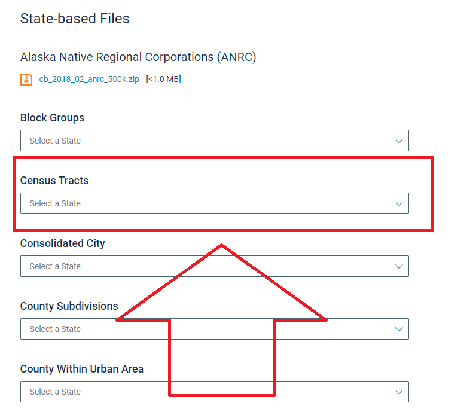

# Census JSON

This app filters census KML files, and generates a geoJSON file which can be used for map visualizations. The app is currently configured to filter California census tracts, but can easily be configured for other states and other geographic subdivisions. The idea is to provide a simple way for data scientists to generate geoJSON files.

Each geographic subdivision will have a unique identifier. For example, US census tracts are defined by an eleven digit tract ID `01001020100`. The census KML file contains a polygon for each census tract, and the tract ID. The user can use any dataset containing the 11 digit tract ID to generate visulatizations of  census tracts. This logic can be applied to census blocks, zip codes, states, or any other subdivision with unique identifiers.

## Installation
From the base directory, run

		python setup.py install

## Census Tract Dataset
1. Download the cartographic boundary KML file, representing the census tracts for your state, from the [US Census Bureau website](https://www.census.gov/geographies/mapping-files/time-series/geo/kml-cartographic-boundary-files.html).

2. Convert the KML file to a geoJSON file, using the toolbox [kml2geojson](https://github.com/mrcagney/kml2geojson).

Command line:
		
		k2g 'data/tracts.kml', 'data/'

Python:
		
		import kml2geojson
		kml2geojson.convert('data/tracts.kml', 'data/')

## Usage

Apply linear heatmap.

		import CensusJSON.Heatmap as heatmap
		df['Color'] = df['Population'].apply(lambda x: heatmap.LinearHeatmap(x, max))

Filter to census tracts.

		import CensusJSON.CensusTracts as tracts
		outJson = tracts.filterGeoJSON(la_df, 'data/tracts.geojson')

## Contributing
This repo uses Sphinx documentation. To build the documentation, execute the following command in the folder `docs`. HTML documentation is built in the folder `build`.

		make html

